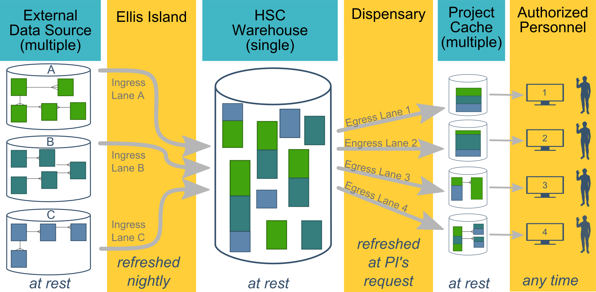

This document contains existing and proposed ideas how OUHSC's multiple EMRs can contribute to research and medical practice knowledge, in a way that's accountable and scalable.  This system will be useful to many **project leads** pursuing a range of activities, including (a) formal research, (b) quality improvement studies (QI), (c) quality assurance and control monitoring of clinical operations, (d) applications for new grants, and (e) demonstrating qualifications for new contracts.

-------------

Process Summary
=================================================

The process starts with an **External Data Sources**, which in this case, are the various EMRs on campus.  For each source, a subset of information is frequently sent through **Ellis Island**, which cleans and validates the data stream before accepted by the **HSC Warehouse**.  

At the project lead's request, a small subset of the data is distributed by the **Dispensary** to a **Project Cache**.  The cache is typically stored in a REDCap database, which has several advantages related to security and maintainability.  Finally, **Authorized Researchers** on the team can access their cache only by using their personal authentication information (maintained by Campus IT).

-------------

Motivations for Developing an Accessible Warehouse
=================================================
{*Convert these bullets into a few cohesive paragraphs.* }

   1. Important for OUHSC's ability to (a) compete for grants and (b) care for patients.

   1. "I don't think that OU can wait with this much longer, even if folks may not realize this. We are already at a considerable competitive disadvantage compared to most other large universities. We are talking about the value of healthcare we provide, not just research." (Quote from Zsolt in a Dec 16 email.)

   1. "In the current climate of lethal communicable diseases and various epidemiological threats, it is imperative that we do something about systematic clinical data collection that could eventually enable us to run meaningful local surveillance programs through a data warehouse." (Quote from Zsolt in a Dec 16 email.)

   1.  Researchers and clinicians cannot easily recover data that they themselves have entered in the EMRs.  Consequently, they are forced to resort to undesirable work-arounds, such as creating their own mini-databases.  This is undesirable for several reasons, including:
      * The dataset is only a subset of the richer & broader EMR data.  The research/QI investigation suffers because this dataset does not have the full range of (a) patients, (b) variables, and (c) longitudinal history.
      * The duplicate data entry leads to poor data quality and wasted effort.
      * These mini-databases are often poorly managed (eg, a collection of loose Excel files).  Because PHI is involved, OUHSC's potential liability is increased, and there is a higher risk of compromising the privacy of our patients.

-------------

Component Details
=================================================

### External Data Sources (column 1)

* The BBMC has done something similar with OHCA, OSDH, & DHS data.  Family Medicine has done something similar with zzzz.  This resembles those efforts in that zzzz.

* {*Zsolt's terminology: We may use campus "Clinical Data Repositories" or something similar. Data may move from various CDRs to the CDW. This will leave the door open for federated data access in the future (indexing, without moving data to the CDW), which I would not even bring up now.*}

### Ellis Island (column 2)
This software layer controls what information is passed to the warehouse.  It will be responsible for:

* Transforming individual values (eg, translating missing codes to a standardized set).
* Transforming data structures (eg, from a [wide](http://en.wikipedia.org/wiki/Wide_and_narrow_data) to a long format -necessary for many suboptimal non-EMR sources).
* Verifying the incoming dataset conforms to an expected schema.
* Quarantining dirty records that cannot be validated and transformed.

#### Specifying the filter
The last bullet is the most subjective.  The goal is to deny all dirty data (while permitting all good data), however it can be difficult to determine the threshold between 'good' and 'bad'.  The specification of the filtering algorithm will consider several tradeoffs, such (a) allowing too much dirty data weakens downstream statistical conclusions, yet (b) dispensing only perfect records typically produces a sample that's too small, and not a representative of the population.

The goals become even murkier when the threshold between clean and dirty differs between projects.  Research pursuing causal claims typically favor strong internal validity, and thus desire higher filter thresholds.  In contrast, research estimating population trends typically favor strong external validity, and thus desire more lenient thresholds.  We anticipate most OUHSC QI projects will fall in the middle of this spectrum.  The statisticians, system architects, and governance board should discuss this issue and consider how to best address the campus needs.  One possible solution is to indicate the completeness & cleanliness of each record.  This would allow the casual research to filter out dirty records more easily.

Ingress metadata will be logged so we can monitor and adjust the filter and label definitions.

#### Selecting software
The schema of an EMR won't change frequently, so it's preferable to use a language that catches discrepancies (between the EMR and Ellis code, and between the Ellis code and the Warehouse) at compile time.  This suggests using strongly-typed ADO.NET datasets in C#, especially considering the campus's preference for Windows and SQL Server.  With previous with large datasets, we've had success with the [ADO Bulk Inserts](https://msdn.microsoft.com/en-us/library/vstudio/1y8tb169%28v=vs.100%29.aspx) which don't bother wrapping each record in a transaction, but still validate the values before committing the whole batch.

I'm not opposed to something like Django or Java if a proponent wants to discuss it; using these languages might mean using Postgres instead of SQL Server.  Also, there's no reason why all lanes in Ellis Island need to use the same language.  Two or three languages might provide more flexibility (to accommodate different data sources and team members) while still being a manageable code base.  We should consider using a functional language for the smaller data sources that are likely to change, and a strongly-typed/OO language for the more mature & stable datasources.  Perhaps only the metadata logging mechanism would need to be developed in duplication.

#### Avoiding unnecessary data
Following the [agile software principles](http://www.agilemanifesto.org/), all features of all data sources will not be replicated in the warehouse.  Development will start with the elements most relevant to immediate research and QI goals on campus.  Avoiding the unnecessary tables and columns will:

* Reduce software development time.
* Reduce the nightly updates, as well as hardware, storage, and network requirements.
* Decrease the chances the Ellis code and data warehouse code will need to change when the schema of the external data sources are modified.

We'll also try to avoid copying unnecessary rows.  Ideally the nightly operations copy only the new and modified records.  If the data source doesn't expose  record timestamps, additional mechanisms will need to be developed.  Less sophisticated data sources (which are less likely to contain timestamps than larger systems) may be small enough to copy every night.

### HSC Warehouse (column 3)
A [column-major data structure](http://searchdatamanagement.techtarget.com/definition/columnar-database) is preferred over the the typical OLTP database, because it is optimized for batch processing.  The development team is currently working withthe [columnstore feature in SQL Server 2016](http://searchsqlserver.techtarget.com/feature/SQL-Server-2014-columnstore-index-the-good-the-bad-and-the-clustered), since it's relatively easy to find programmers that are comfortable with SQL Server, and Campus IT supports hosted versions of it.

Depending on the types of free text it will store, a "document database", or some type of NoSQL database may be incorporated. There are other datasources besides EMRs; however they're mostly contained by conventional databases, and thus won't require the flexibility and headaches of NoSQL.  The third column of the CDW ecosystem is platform agnostic as possible; its incoming and outgoing interfaces have been specified so that the column's implementation could be replaced (with something like i2b2) without re-developing the other five columns.

The internals of the warehouse need to be flexible, and not try to pursue 'the right way' to represent data.  At the very least, it needs to anticipate and accommodate:

1. Multiple data sources with different and potentially incompatible *schemas*.
2. Multiple data sources with different and potentially conflicting *values* (eg, an EMR reports a different DOB than a tissue repository).
3. Iterations and evolution over time.  As Judith James observed, the schema we specified in 2015 won't be perfect.  We'll always want to adapt and improve the system as we learn ways to improve it to facilitate better research.  We don't want a brittle system that is frozen in time.
4. New data sources that aren't currently considered, or perhaps do not currently exist.

The warehouse can contain only existing data from upstream external data sources (column 1).  Some consequences of its copy-cat behavior are:

* The external data sources (Column 1) will never reflect any data modifications that occur in the Warehouse (Column 3) or Project Caches (Column 4).  The CDW will not be used by providers to inform clinical care for a specific patient.
* It does not have a GUI or any capability for humans to enter new data.  If a researcher needs to collect measures that aren't in an existing data source, a new database (separate from the warehouse) will need to be created.
* The backup requirements can be relaxed, compared to the vigilance required of clinical databases.  If the entire warehouse were accidentally deleted, no information would be irrevocably lost, because the Ellis lanes would re-import from the original sources.  Regardless, the warehouse will be backed up regularly to avoid this time-consuming operation that could stress the upstream sources and campus network.

Here is a summary of the warehouse internals.  Details are specified in a separate technical documents.

1. If there are *k* large external sources in column 1, column 3 contains up to *k* + 2 databases.
1. For each large external source, a single 'staging' database may exists in the CDW.  Because some external sources are available to the CDW pipeline for only a portion of a day, a 'firehose' transports the desired subset of columns and tables to the CDW before the window closes.  Although the CDW could theoretically access a live EMR, it was decided to access the EMR's read-only companion server.  This isolation substantially reduces the possibility that the CDW ecosystem could negatively affect patient care.  Because less risk is involved, the CDW's development costs are lowered.
1. The core of the CDW is a single large SQL Server database.  It contains several layers of hierarchy, as data from the different sources is assimilated.

    Multivariate-informed cleaning is an example of an operation that occurs between layers in this database.  For instance, some patients had extremely high or low BMI values, which were caused by their height or weight entered in mislabeled units (*e.g.*, 36 cm instead of 36 inches for a toddler).  One cleaning procedure compares the observed height and weight values to national norms.  If a height observation is 1.5 standard deviations below the 3rd percentile, the value is multiplied by 2.54 as an attempt to recover a clean value in inches.  If this product falls within acceptable range for the patient's age and gender,it is retained; otherwise, the value becomes missing.  This cleaning procedure has been adapted for other patient characteristics where (a) an acceptable range is established and (b) there is a single theory why the data point was mis-entered, and how to correct it.  Of course, the original observation is retained, if case the investigator wishes to use it in column 6.

    This cleaning procedure demonstrates the CDW's overall goal to deliver a dataset that can be analyzed almost immediately.  By delivering a clean dataset, barriers are lowered.  This helps young investigators generate new research and make training opportunities more productive.
1. Before exporting a project cache (to column 5), the data is first stored in a final SQL Server database.  This single database is partitioned into schemas.  A separate schema is dedicated to a project cache.  Authorization to a cache is granted only to CDW staff assigned to the research project, and approved by the IRB.

### Dispensary (column 4)
{*Describe the software that reads from the warehouse and writes to the caches.* }

The existing dispensary lanes have been developed in [R](http://cran.rstudio.com/) for a few reasons.  However like the ingress lanes, the egress lanes can use different languages, especially if there's a minimal amount of redundant code to develop again.

1. There will be many one-off projects,  which is well-suited for a functional language.
2. Many projects will have statisticians, who are more familiar with R than alternatives.
3. The BBMC develops [REDCapR](http://cran.r-project.org/web/packages/REDCapR/), which is a package that facilitates communication with REDCap over R.  However R can still dispense data to the handful of caches that use conventional relational databases.
4. The caches are not large enough to expose R's limitations with big data.

### PI Caches (column 5)
* The PHI will be delivered in a container that requires LDAP authentication to access.  Emailing the patient data in an Excel file is virtually condoning bad & risky behavior.  Distributing Excel files requires the recipient to create their own one-off data system, which they likely lack the knowledge and time to do properly.  It should be easy for researchers to follow best security practices, and delivering the PHI in REDCap or SQL Server is a big help.

* A REDCap project should address most needs, although we expect that the exceptionally complex studies will require a relational database.  SQL Server is our recommendation for OUHSC, since Campus IT is most experienced with it.  

    To conserve time and resources, initially the caches will be hosted by the same SQL Server (but in an isolated database that requires different credentials and does not share data).  As the CDW ecosystem scales out, these caches can be hosted by a different server.  

* Four service options  (see the 'Services and Pricing' section below)
    * Tier 3: Multilevel data in a relational database, like SQL Server (retainer + hourly fee)
    * Tier 2: 3D box in REDCap (hourly fee)
    * Tier 1: Cookie-cutter in REDCap (free)
    * Tier 0: Cookie-cutter in REDCap with fake data (free)

### Authorized Researchers/Users (column 6)

Once authenticated in column 6, researchers and practitioners are able to conduct any subsequent operations approved by the IRB.  REDCap provides some basic graphics and descriptive statistics.  For more advanced analysis, there are [many libraries](http://redcap-tools.github.io/projects/) in popular languages that access data through REDCap's API, including our recommendation of [REDCapR](https://github.com/OuhscBbmc/REDCapR).

For several pilot projects, the CDW staff has developed interactive [Shiny](https://shiny.rstudio.com/) reports that facilitate descriptive and inferential analysis.

In another instance, the CDW staff developed an automated report that informs researchers of potential participants.  These individuals are selected from a collaborating clinic's patients who meet certain criteria.

-------------

Services and Pricing
=================================================
The system should accommodate a wide spectrum of activities, ranging from relatively quick examinations of patient trends, to complicated research questions.  Initially, the system will offer three tiers of service.  We envision that Tiers 0, 1, & 2 projects would store their cache in REDCap, while Tier 3 caches require a relational database (eg, SQL Server).

For more information, please see the related 'services' document, available in the repository's [documentation](https://github.com/OuhscBbmc/prairie-outpost-public/tree/master/documentation).

-------------

Planned Future Capabilities
=================================================
As stated above, the overall goal of the pilot projects is to select about a dozen investigations (a) that are suffering from a lack of this long-overdue capability and (b) can be achieved by this (relatively) simple one-way flow of information.  The next wave of additions to the ecosystem are the following:

1. **Forecasting** has become an important tool in health care and social services, and the faculty on the CDW team have had success implementing a real-time state-wide prediction mechanism for Oklahoma's Child Protection Services (CPS).  It determines a risk-score for each individual in a home suspected of child maltreatment.  The algorithm considers factors such as (a) the thorough snapshot of the environment at the time of the report, (b) the evidence and details behind the allegations, and (c) the perpetrators' entire history documented in the state agency's database.  The risk-score informs the state's decision to remove a child into custody, or to allow the family to remain together wile receiving "Intensive Safety Services" ([ISS](http://www.okdhs.org/OKDHS%20PDF%20Library/ChildandFamilyServicesPlan2015-2019_cws_10052016.pdf)).  Over the past two years, this Waiver program has saved the state's foster home costs, while decreasing recurrent maltreatment reports.  Companion projects have later connected the CPS data sources with a different state databases (*i.e.*, the vital birth records and the home-visiting services provided by the Department of Health).

    Although this program does not involve the OUHSC CDW, it is relevant for three reasons.  First, the same personnel in the CPS forecasting are members of the larger CDW team.  Second, it demonstrates their experience of working with multiple stakeholders to develop a data warehouse that combines multiple complex data sources.  Third, it demonstrates their success employing statistical models that transform information in a warehouse into forecasts that improve real-time services.

    The CDW's team of statisticians, database administrators, and EMR experts have started to work with OU Physicians to provide location-level and patient-level forecasts.

1. [**i2b2**](https://www.i2b2.org/) is the NIH-funded open-source informatics warehouse deployed in many translational research centers.  Potentially it replaces most of column 3, or potentially it consumes data from column 3 (as suggested by a fellow OSCTR university with i2b2) and becomes essentially a huge project cache in column 5.

    Many teams have requested to be included in the CDW's pilot projects, and the volume of authorized researchers and practitioners on campus is expected to rapidly increase over the next five years.  The interface of i2b2 will accommodate this growth, because its interface design and support documentation has already received much more investment than our single campus could ever invest in ours.  A campus instance of i2b2 will leverage knowledge and effort from inside and outside the OUHSC campus.

    The CDW development team has been evaluating i2b2 since the planning stage, and chose to delay its deployment because most of the initial lessons are independent of the column 3 implementation (such as learning the schema of the column 1 sources).  These lessons are still applicable when i2b2 is incorporated.

1. [**TriNetX**](https://www.trinetx.com/) is a health sciences research organizations that uses i2b2 to connect investigators on a campus to larger research projects, particularly pharmaceutical trials.  Collaborating with TriNetX should provide more research opportunities for investigators and more revenue streams for the university.

1. [**Hadoop**](http://hadoop.apache.org/) is a common foundation for big data analytics.  It allows an operation (such as estimating a statistical model) to execute across multiple machines with local, nonshared data.  The CDW's current projects have analyzed (relatively) tidy rectangular datasets that are adequately accommodated by [R](http://cran.rstudio.com/) and SQL Server.  However, future projects will involve more intense analysis of larger hierarchical structures containing unstructured text.  These tasks are better accommodated by Hadoop because the operations are more flexible, and are not constrained by the RAM of a single machine.

1. **De-identified Section** Vanderbilt's system is divided into a section with patient-identified data, and different section without PHI.  The first section is necessary for most research, but the section helps generate research *proposals* faster.  Because PHI has been removed, less regulation and oversight is required for each inquiry, which otherwise can takes weeks or months (especially if answering one questions begs a series of others, which requires repeated trips through the IRB).  Researchers can obtain counts (*e.g.*, of the patients with a certain combination of diagnoses) quickly as to gauge the feasibility of their proposed research.  The CDW development team will implement this capability following the deployment of i2b2.  (i2b2 provides much of this already, such as the "[Patient Count Plug-in](https://www.i2b2.org/software/files/PDF/current/PatientCount_Functional_Specification.pdf)")

-------------

Possible Future Capabilities
=================================================
The following capabilities have been discussed as beneficial to the campus.  They are not prioritized to be included in the next wave of CDW development, but this could be influenced by new needs and/or funding.  The CDW has been designed so that these features could be incorporated in the future, and not require breaking changes to the existing architecture.  Here are some additional capabilities that we might incorporate in the future.  If you anticipate a need that is not addressed by the current plan and these additional capabilities, please tell us.

1. **Provenance**: Currently, once a data point is accepted by the warehouse, it's history is erased.  In other words, it's not possible to tell if a value came from data source A, B, or C.  The origin/history may need to be retained in the warehouse, in order to meet regulatory or research needs.

1. **Selectively Updating the Cache**:  For the pilots, the PI data cache cannot have a portion of the data updated.  Everything must be erased and updated with the current state of the warehouse.  This is undesirable, because any changes made to the cache would be lost as well.  In the future, we'd like the users to have the ability to both (a) modify their cache while (b) receive updates from the warehouse.

1. **[GPC](http://www.gpcnetwork.org/)**
    * This collaborative shares data, and is facilitated by each member's i2b2 installation.  Similar to TriNetX, joining the GPC will expose our CDW staff to other approaches and institutions.  It improves our existing infrastructure (by giving us access to existing pipeline code) and providing smoother access to the GPC's repository of data.

-------------

Unlikely Future Capabilities
=================================================
Some features are beyond the scope of the CDW.  These are listed below to further demarcate the future boundaries of the CDW, and explain why they are not currently desired.

1. **"Right-to-left" data flow**: allow researchers to modify warehouse data, and possibly EMR data.  Currently they can only modify their own caches.  

    Any automated content within an EMR should be written by EMR developers.  The BBMC and CDW staff will develop and estimate the forecasting models, and then deliver the calculation and coefficients to the EMR team.  The CDW staff might sometimes be a step behind the EMR staff (because the CDW structure and data is derived from the EMR).  For instance, an EMR form or field might change that affects the forecast.  This lag is acceptable for modeling, reporting, & participant-selection.  But it is not acceptable for patient-level forecasts that may affect someone's care.  It's not economically feasible for two staffs (ie, EMR & CDW) to be paid to stay involved in every single change to the EMR.

-------------

Governance and Approval of Projects
=================================================

This process is described in the "Governance of Prairie Output Prototype" document, located in the private [repository](https://github.com/OuhscBbmc/prairie-outpost-public).  Please contact Will Beasley to request access.

-------------

Current Collaborators
=================================================
The current draft was prepared by Will Beasley and David Bard, in [OUHSC Pediatrics](http://www.oumedicine.com/pediatrics), Biomedical and Behavioral Methodology Core ([BBMC](http://www.ouhsc.edu/BBMC/)), and Zsolt Nagykaldi, Director of Research in [OUHSC Family Medicine](http://www.oumedicine.com/familymedicine).

Support and contributions have also been given by Judith James ([OSCTR](http://osctr.ouhsc.edu/) Principal Investigator/Program Director), Joel Guthridge ([OMRF](http://omrf.org/) & [OSCTR](http://osctr.ouhsc.edu/)), and Tim VanWagoner ([OSCTR](http://osctr.ouhsc.edu/) Deputy Director), as well as from the Bob Roswell and Darrin Akins ([COM](http://www.oumedicine.com/collegeofmedicine) Associate Deans).

Teresa Bosler of [UT Southwestern](http://www.utsouthwestern.edu/research/translational-medicine/about/contact.html) and Steve Berry and Kelli Hirsch of [Boston Children's Hospital](http://hms.harvard.edu/about-hms/hms-affiliates/boston-childrens-hospital) graciously shared some of their experiences with their mature systems.
