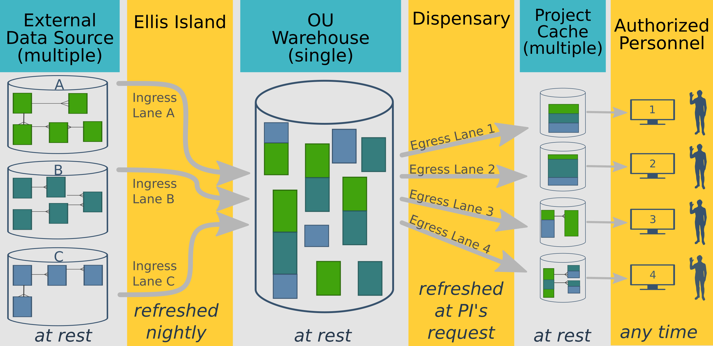

This document contains some working ideas on how OUHSC's multiple EMRs can contribute to research and medical practice knowledge, in a way that's accountable and scalable.  This system will be useful to many **project leads** pursuing a range of activities, including (a) formal research, (b) quality improvement studies (QI), (c) quality assurance and control monitoring of clinical operations, (d) applications for new grants, and (e) demonstrating qualifications for new contracts.

-------------

Process Summary
=================================================

The process starts with an **External Data Sources**, which in this case, are the various EMRs on campus.  For each source, a subset of information is frequently sent through **Ellis Island**, which cleans and validates the data stream before accepted by the **HSC Warehouse**.  

At the project lead's request, a small subset of the data is distributed by the **Dispensary** to a **Project Cache**.  The cache is typically stored in a REDCap database, which has several advantages related to security and maintainability.  Finally, **Authorized Researchers** on the team can access their cache only by using their personal authentication information (maintained by Campus IT).

-------------

Motivations for Developing an Accessible Warehouse
=================================================
{*Convert these bullets into a few cohesive paragraphs.* }

   1. Important for OUHSC's ability to (a) compete for grants and (b) care for patients.

   1. "I don't think that OU can wait with this much longer, even if folks may not realize this. We are already at a considerable competitive disadvantage compared to most other large universities. We are talking about the value of healthcare we provide, not just research." (Quote from Zsolt in a Dec 16 email.)

   1. "In the current climate of lethal communicable diseases and various epidemiological threats, it is imperative that we do something about systematic clinical data collection that could eventually enable us to run meaningful local surveillance programs through a data warehouse." (Quote from Zsolt in a Dec 16 email.)

   1.  Researchers and clinicians cannot easily recover data that they themselves have entered in the EMRs.  Consequently, they are forced to resort to undesirable work-arounds, such as creating their own mini-databases.  This is undesirable for several reasons, including:
      * The dataset is only a subset of the richer & broader EMR data.  The research/QI investigation suffers because this dataset does not have the full range of (a) patients, (b) variables, and (c) longitudinal history.
      * The duplicate data entry leads to poor data quality and wasted effort.
      * These mini-databases are often poorly managed (eg, a collection of loose Excel files).  Because PHI is involved, OUHSC's potential liability is increased, and there is a higher risk of comprosing the privacy of our patients.

-------------

Component Details
=================================================

### External Data Sources (column 1)

* The BBMC has done something similar with OHCA, OSDH, & DHS data.  Family Medicine has done something similar with zzzz.  This resembles those efforts in that zzzz.

* {*Zsolt's terminology: We may use campus "Clinical Data Repositories" or something similar. Data may move from various CDRs to the CDW. This will leave the door open for federated data access in the future (indexing, without moving data to the CDW), which I would not even bring up now.*}

### Ellis Island (column 2)
This software layer controls what information is passed to the warehouse.  It will be responsible for:

* Transforming individual values (eg, translating missing codes to a standardized set).
* Transforming data structures (eg, from a [wide](http://en.wikipedia.org/wiki/Wide_and_narrow_data) to a long format).
* Verifying the incoming dataset conforms to an expected schema.
* Quarantining dirty records that cannot be validated and transformed.

#### Specifying the filter
The last bullet is the most subjective.  The goal is to deny all dirty data (while permitting all good data), however it can be difficult to determine the threshold between 'good' and 'bad'.  The specification of the filtering algorithm will consider several tradeoffs, such (a) allowing too much dirty data weakens downstream statistical conclusions, yet (b) dispensing only perfect records typically produces a sample that's too small, and not a representative of the population.

The goals become even murkier when the threshold between clean and dirty is differs between projects.  Research pursuing causal claims typically favor strong internal validity, and thus desire higher filter thresholds.  In contrast, research estimating population trends typically favor strong external validity, and thus desire more lenient thresholds.  We anticipate most OUHSC QI projects will fall in the middle of this spectrum.  The statisticians, system architects, and governance board should discuss this issue and consider how to best address the campus needs.  One possible solution is to indicate the completeness & cleanliness of each record.  This would allow the casual research to filter out dirty records more easily.

Ingress metadata will be logged so we can monitor and adjust the filter and label definitions.

#### Selecting software
The schema of an EMR won't change frequently, so I'd like a language with that catches discrepancies (between the EMR and Ellis code, and between the Ellis code and the Warehouse) at compile time.  This suggests using strongly-typed ADO.NET datasets in C#, especially considering the campus's preference for Windows and SQL Server.  With previous with large datasets, we've had success with the [ADO Bulk Inserts](https://msdn.microsoft.com/en-us/library/vstudio/1y8tb169%28v=vs.100%29.aspx) which don't bother wrapping each record in a transaction, but still validate the values before committing the whole batch.

I'm not opposed to something like Django or Java if a proponent wants to discuss it; using these languages might mean using Postgres instead of SQL Server.  Also, there's no reason why all lanes in Ellis Island need to use the same language.  Two or three languages might provide more flexibility (to accommodate different data sources and team members) while still being a manageable code base.  We should consider using a functional language for the smaller data sources that are likely to change, and a strongly-typed/OO language for the more mature & stable datasources.  Perhaps only the metadata logging mechanism would need to be developed in duplication.

#### Avoiding unnecessary data
Following the [agile software principles](http://www.agilemanifesto.org/), all features of all data sources will not be replicated in the warehouse.  We'll start with the elements that are most relevant to immediate research and QI goals on campus.  Avoiding the unnecessary tables and columns will:

* Reduce our software development time.
* Reduce the nightly updates, as well as hardware, storage, and network requirements.
* Decrease the chances the Ellis code and data warehouse code will need to change if the schema of the external data sources are modified.

We'll also try to avoid copying unnecessary rows.  Ideally the nightly operations copy only the new and modified records.  If the data source doesn't expose  record timestamps, additional mechanisms will need to be developed.  Less sophisticated data sources (which are less likely to contain timestamps than larger systems) may be small enough to copy every night.

### HSC Warehouse (column 3)
We'd like to start with a [column-major database](http://searchdatamanagement.techtarget.com/definition/columnar-database) that's optimized for batch processing (as opposed to the typical OLTP database).  We're currently leaning towards the [columnstore feature in SQL Server 2014](http://searchsqlserver.techtarget.com/feature/SQL-Server-2014-columnstore-index-the-good-the-bad-and-the-clustered), since it's relatively easy to find programmers that are comfortable with it, and Campus IT supports hosted versions of it.

Depending on the types of free text it will store, a "document database", or some type of NoSQL database may be the eventual best fit.  We'll have a better feel for the best fit once we have learn more about the schemas of the EMRs (and how rigid vs hippie the structure is).  There are other datasources besides EMRs; however they're mostly contained by conventional databases, and thus won't require the flexibility and headaches of NoSQL.  Alternatively, Joel Gurthridge, with OMRF and OSCTR, mentioned other campus players are considering other systems (eg, i2b2); it's appealling to consolidate and leverage existing campus knowledge & investment when possible.

The internals of the warehouse need to be flexible, and not try to pursue 'the right way' to represent data.  At the very least, it needs to anticipate and accommodate:

1. Multiple data sources with different and potentially incompatible *schemas*.
2. Multiple data sources with different and potentially conflicting *values* (eg, an EMR reports a different DOB than a tissue repository).
3. Iterations and evolution over time.  As Judith James observed, the schema we specify in 2015 won't be perfect.  We'll always want to adapt and improve the system as we learn ways to improve it to facilitate better research.  We don't want a brittle system that frozen in time.
4. New data sources that aren't currently considered, or perhaps do not currently exist.

The warehouse can contain only existing data from upstream external data sources (column 1).  Some consequences of its copy-cat behavior are:

* The external data sources will never reflect any data modifications that occur in the Warehouse (Column 3) or Project Caches (Column 4).  It will not be used by providers to inform clinical care for a specific patient.
* It does not have a GUI or any capability for humans to enter new data.  If a researcher needs to collect measures that aren't in an existing data source, a new database (separate from the warehouse) will need to be created.
* The backup requirements can be relaxed, compared to the vigilance required of clinical databases.  If the entire warehouse were accidentally deleted, no information would be irrevocably lost, because Ellis Island could could re-import from the original sources.  Regardless, the warehouse will be backed up regularly (perhaps nightly or weekly) to avoid this time-consuming operation that would stress the upstream sources and campus network.

The internals of the warehouse will be specified in a separate technical document.

### Dispensary (column 4)
{*Describe the software that reads from the warehouse and writes to the caches.* }

I'm leaning toward [R](http://cran.rstudio.com/) for a few reasons.  However like the ingress lanes, the egress lanes can use different languages, especially if there's a minimal amount of redundant code to develop again.

1. There will be many one-off projects,  which is well-suited for a functional language.
2. Many projects will have statisticians, who are more familiar with R than alternatives.
3. The BBMC develops [REDCapR](http://cran.r-project.org/web/packages/REDCapR/), which is a package that facilitates communication with REDCap over R.  However R can still dispense data to the handful of caches that use conventional relational databases.
4. The caches are not large enough to expose R's limitations with big data.

### PI Caches (column 5)
* The PHI will be delivered in a container that requires LDAP authentication to access.  Emailing the patient data in an Excel file is virtually condoning bad & risky behavior.  It also requires the recipient to create their own one-off data system, which they likely lack the knowledge and time to do properly.  It should be easy for them to do the right thing; delivering the PHI in REDCap or SQL Server is a big help.

* A REDCap project should address most needs, although we expect that the exceptionally complex studies will require a relational database.  SQL Server is our recommendation for OUHSC, since Campus IT is most comfortable with it.  

    To conserve time & resources, initially the caches will be hosted by the same SQL Server (but in an isolated database that doesn't share data and requires different credentials).  As the CDW ecosystem scales out, these caches can be hosted by a different server.  

* Four service options  (see the 'Services and Pricing' section below)
    * Tier 3: Multilevel data in a relational database, like SQL Server (retainer + hourly fee)
    * Tier 2: 3D box in REDCap (hourly fee)
    * Tier 1: Cookie-cutter in REDCap (free)
    * Tier 0: Cookie-cutter in REDCap with fake data (free)

### Authorized Researchers/Users (column 6)
{*Describe the users, and how they'll access and use the cache.* }

-------------

Services and Pricing
=================================================
The system should accommodate a wide spectrum of activities, ranging from relatively quick examinations of patient trends, to complicated research questions.  Initially, the system will offer three tiers of service.  We envision that Tiers 0, 1, & 2 projects would store their cache in REDCap, while Tier 3 caches require a relational database (eg, SQL Server).

For more information, please see the related 'services' document, available in the repository's [documentation](https://github.com/OuhscBbmc/prairie-outpost-public/tree/master/documentation).

-------------

Possible Future Capabilities
=================================================
As stated above, our goal with the pilots is to select a few projects (a) that are suffering from a lack of this long-overdue capability and (b) can be achieved by this (relatively) simple one-way flow of information.  We recognize that this initial design cannot address all future needs.  Here are some additional capabilities that we might incorporate in the future.  If you anticipate a need that is not addressed by the current plan and these additional capabilities, please tell us.

  1. **Provenance**: Currently, once a data point is accepted by the warehouse, it's history is erased.  In other words, it's not possible to tell if a value came from data source A, B, or C.  The origin/history may need to be retained in the warehouse, in order to meet regulatory or research needs.

  1. **Selectively Updating the Cache**:  For the pilots, the PI data cache cannot have a portion of the data updated.  Everything must be erased and updated with the current state of the warehouse.  This is undesirable, because any changes made to the cache would be lost as well.  In the future, we'd like the users to have the ability to both (a) modify their cache while (b) receive updates from the warehouse.

  1. **De-identified Section** Vanderbilt's system is divided into a section with patient-identified data, and section where all PHI has been stripped.  The first part is necessary for most research, but the second helps generate research *proposals* faster.  As I understand it, the researcher doesn't need to go through as many regulatory and oversight steps, which can takes weeks or months (especially if answering one questions begs a series of others, which requires repeated trips through the IRB).  They can obtain counts (eg, of the patients with a certain combination of diagnoses) quickly as they're gauging the feasibility of their proposed research.

  1. ~~**"Right-to-left" data flow**: allow researchers to modify warehouse data, and possibly EMR data.  Currently they can only modify their own caches.~~

-------------

Governance and Approval of Projects
=================================================

This process is described in the "Governance of Prairie Output Prototype" document, located in the private [repository](https://github.com/OuhscBbmc/prairie-outpost-public).  Please contact Will Beasley to request access.

-------------

Current Collaborators
=================================================
The current draft was prepared by Will Beasley and David Bard, in [OUHSC Pediatrics](http://www.oumedicine.com/pediatrics), Biomedical and Behavioral Methodology Core ([BBMC](http://www.ouhsc.edu/BBMC/)), and Zsolt Nagykaldi, Director of Research in [OUHSC Family Medicine](http://www.oumedicine.com/familymedicine).

Support and contributions have also been given by Judith James ([OSCTR](http://osctr.ouhsc.edu/) Principal Investigator/Program Director), Joel Guthridge ([OMRF](http://omrf.org/) & [OSCTR](http://osctr.ouhsc.edu/)), and Tim VanWagoner ([OSCTR](http://osctr.ouhsc.edu/) Deputy Director), as well as from the Bob Roswell and Darrin Akins ([COM](http://www.oumedicine.com/collegeofmedicine) Associate Deans).

Steve Berry and Kelli Hirsch of [Boston Children's Hospital](http://hms.harvard.edu/about-hms/hms-affiliates/boston-childrens-hospital) graciously shared some of their experiences with their mature system, as well as plans with the PI Cache Templates.
